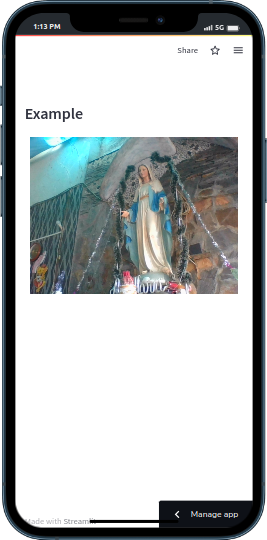

# streamlit_back_camera_input
Streamlit camera input with back camera as default  
Just touch on video area to take a picture
 

Notes: It only works with https 
## Installation:
```
pip install streamlit-back-camera-input
```

## Example

```python
import streamlit as st

from streamlit_back_camera_input import back_camera_input

image = back_camera_input()
if image:
    st.image(image)
```
